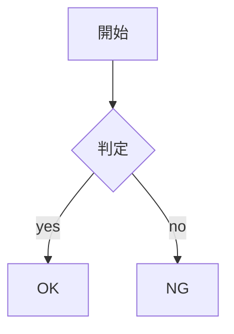

# mdview sample

Mermaid:

```mermaid
graph TD
  A[開始] --> B{判定}
  B -->|yes| C[OK]
  B -->|no| D[NG]
```

Display math:

$$
\sum_{i=1}^n \frac{1}{i^2}
$$

Inline $x^2$ stays as text.

Broken:

```mermaid
graph TD
  A -->
```

Last line math:
$$ e^{i\pi} + 1 = 0 $$
